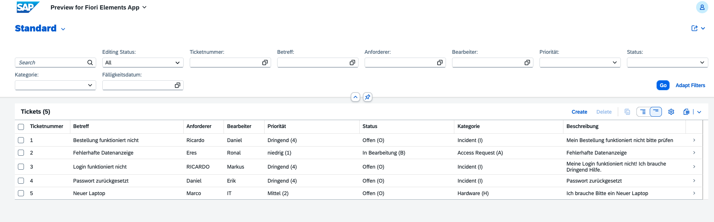
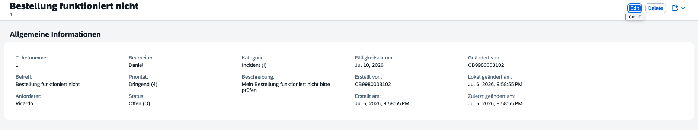
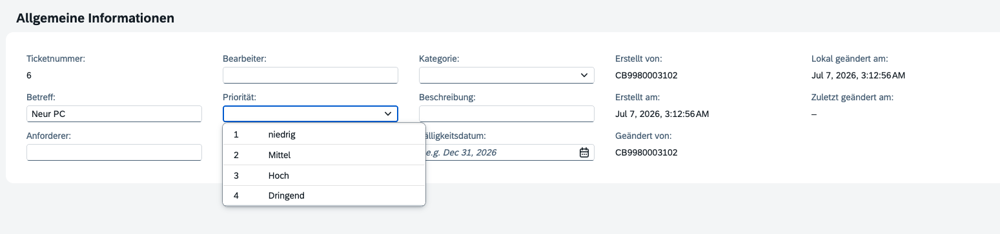
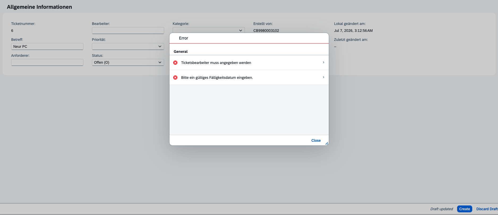
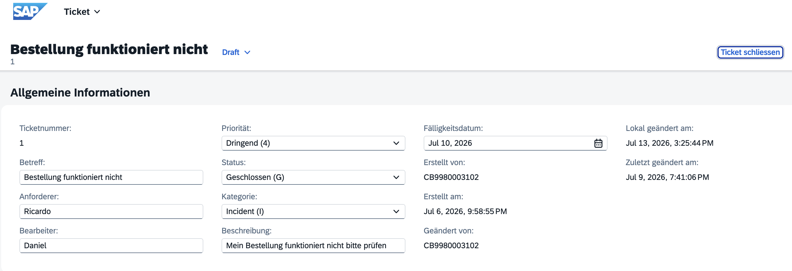

# SAP RAP Ticket System

Ticket-Management-System für IT-Support- und Change-Request-Prozesse, entwickelt mit dem SAP RESTful Application Programming Model (RAP) auf der SAP Business Technology Platform.

## Funktionsumfang

- Vollständiges Ticket-Lifecycle-Management mit Draft-Handling (Anlegen, Bearbeiten, Aktivieren, Verwerfen)
- Automatische ID-Vergabe (Early Numbering)
- Automatisierte Statussteuerung beim Anlegen neuer Tickets
- Serverseitige Validierung von Pflichtfeldern und Geschäftsregeln
- Kategorisierung nach Typ (Incident, Change Request, Hardware, Software, Access Request)
- Priorisierung (Niedrig bis Dringend)
- Volltextsuche über zentrale Ticketfelder
- Wertehilfen mit Klartext-Anzeige für Status, Priorität und Kategorie

## Architektur

Datenbanktabelle
       ↓
Interface View (CDS)
       ↓
Behavior Definition ←→ Behavior Pool (ABAP-Klasse)
       ↓
Projection View
       ↓
Service Definition → Service Binding (OData V4)
       ↓
Fiori Elements UI

Das Datenmodell folgt konsequent der RAP-Schichtentrennung: Die Root-Ebene bildet ausschliesslich physische Tabellenfelder und Assoziationen ab; sämtliche UI-spezifische Logik (Textauflösung, Wertehilfen, Feldbeschriftungen) ist in der Projection-Ebene und den Metadata Extensions gekapselt.

## Projektstruktur

01_database_tables/         Persistenz- und Referenztabellen
03_interface_views/         Root CDS View Entities
04_projection_views/        Consumption Views mit UI-Annotationen
05_behavior_definitions/    RAP Behavior Definitions (Root & Projection)
06_behavior_implementations/ABAP-Klassen: Determinations, Validations, Numbering
07_value_helps/             Value-Help-Entities für Status, Priorität, Kategorie
08_service_definitions/     OData-V4-Service-Definitionen
09_metadata_extensions/     UI-Facetten, Feldpositionierung, Objekttitel
notes/                      Technische Notizen zu Implementierungsdetails

## Technologie-Stack

| Bereich | Technologie |
|---|---|
| Backend | ABAP Cloud, RAP (Managed Implementation) |
| Datenmodell | CDS View Entities, Behavior Definitions |
| Persistenz | SAP HANA (BTP ABAP Environment) |
| Frontend | SAP Fiori Elements |
| Protokoll | OData V4 |
| Entwicklungsumgebung | SAP Business Application Studio (BAS) |

## Datenmodell

**Ticket** (Root-Entity)

| Feld | Beschreibung |
|---|---|
| TicketID | Automatisch vergebene, eindeutige Kennung |
| Subject | Betreff, dient als Objekttitel in der UI |
| RequesterID | Ersteller des Tickets |
| AssignedTo | Zuständiger Bearbeiter (Pflichtfeld) |
| Priority | Niedrig / Mittel / Hoch / Dringend |
| Status | Offen / In Bearbeitung / Geschlossen / Gelöst |
| Category | Incident / Change Request / Hardware / Software / Access Request |
| DueDate | Fälligkeitsdatum (darf nicht in der Vergangenheit liegen) |

## Geschäftslogik

- **Determination:** Beim Anlegen wird der Status automatisch auf *Offen* gesetzt.
- **Validation – Bearbeiter:** Ein Ticket kann nicht gespeichert werden, ohne dass ein Bearbeiter zugewiesen ist.
- **Validation – Fälligkeitsdatum:** Das Fälligkeitsdatum muss in der Zukunft liegen.
- **Early Numbering:** Die TicketID wird serverseitig unter Berücksichtigung sowohl der aktiven als auch der Draft-Tabelle eindeutig vergeben.

## Features

✔ Draft Handling

✔ Early Numbering

✔ Determinations

✔ Validations

✔ Actions

✔ Value Helps

✔ Search

✔ Filter

✔ OData V4

✔ Fiori Elements

✔ Metadata Extensions

## Screenshots

### Ticketübersicht
Alle Tickets mit Klartext-Anzeige für Priorität, Status und Kategorie, inklusive vollständiger Filterleiste.

### Ticket-Detailansicht
Einzelansicht eines Tickets mit automatisch vergebener ID und allen Stammdaten.

### Wertehilfe mit Klartext-Anzeige
F4-Wertehilfe mit Code- und Textanzeige, z. B. für das Statusfeld.

### Validierung bei fehlenden Pflichtfeldern
Serverseitige Validierung verhindert das Speichern, solange Pflichtfelder nicht ausgefüllt sind.

### Action: Ticket schliessen
Über eine benutzerdefinierte Action kann ein Ticket direkt aus der Objektansicht geschlossen werden – der Status wird automatisch auf "Geschlossen" gesetzt.

## Autor

Ricardo Varesse Noubissi Simo
SAP Solution Consultant Technology · ABAP Cloud & CPI Integration Developer (SAP-zertifiziert)

[LinkedIn](https://www.linkedin.com/in/ricardo-varesse-noubissi-simo-340319172/)
  
